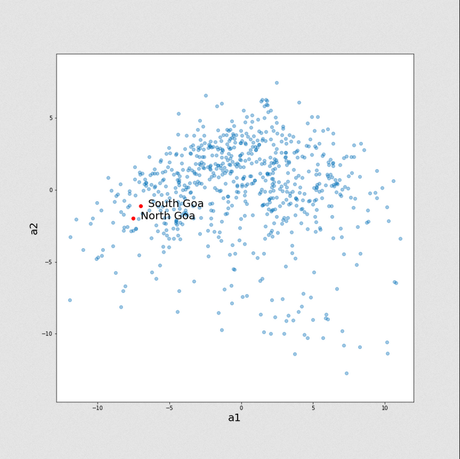
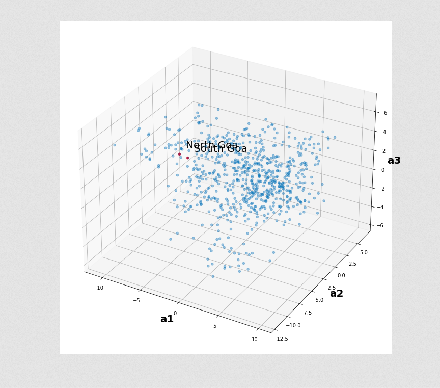

# Read, store and analyze NFHS-5 data from district-level summaries

1. __Download State and District-level PDFs__ [[Link to notebook](https://nbviewer.org/github/kalyaninagaraj/NFHS5/blob/main/DownloadPDFs.ipynb)]  
   Download PDF reports of key indicators for each state/UT and each of their districts from [http://rchiips.org/nfhs/](http://rchiips.org/nfhs/).
   
2. __Pickle the Indicators__ [[Link to notebook](https://nbviewer.org/github/kalyaninagaraj/NFHS5/blob/main/PickleIndicators.ipynb)]  
   Save indicators, names of states/UTs and their respective districts in dictionary format for easy "pickling" (serializing).  
   
3. __Save district-level statistics to DataFrame__ [[Link to notebook](https://nbviewer.org/github/kalyaninagaraj/NFHS5/blob/main/WriteToDataFrame.ipynb)]  
   Read the PDF reports sequentially and store 104 indicator values for all 704 districts in a CSV file.
   
4. __Perform PCA on the reported NFHS-5 data__ [[Link to notebook]()]  
   Perform PCA to (1) reduce dimensionality for plotting, and to (2) impute missing (unavailable) values in the dataset. 
   
   For example, the plot below is a 2D representation of the original 95-dimensional data. This reduction is dimensionality explains only about 34% of the variance in the data. The 3D representation explains roughly 40% of the variance in the data:  
   
|   2-D PCA                 |  3-D PCA                   |
|:-------------------------:|:-------------------------: |
|  |   |
      
   
5. __Display NFHS-5 data on maps using GeoPandas__ [[Link to notebook]()]  
   Generate maps to view reported statistics for each district. Missing or unavailable entries are estimated using Principal Component Analysis (PCA). The images below are screenshots of maps showing three such indicators (or statistics) for different districts in the country. The number of principal components for imputing missing entries is chosen in such a way so as to explain 99% percent of the variance in the dataset. 
   
   (a) __Percentage of literate women (aged 15-49)__ [[Link to HTML map](https://github.com/kalyaninagaraj/NFHS5/blob/main/MAPS/Q14.html)]  
   
      
   
   (b) __Percentage of married women (aged 15-49) who follow some family planning method__ [[Link to HTML map](https://github.com/kalyaninagaraj/NFHS5/blob/main/MAPS/Q20.html)]  
   
     
   
   (c) __Percentage of pregnant women (aged 15-49) who are anaemic__ [[Link to HTML map](https://github.com/kalyaninagaraj/NFHS5/blob/main/MAPS/Q83.html)] 
   
     
   
  
## Code Credit
[@kalyaninagaraj](https://github.com/kalyaninagaraj/)

## Resources
1. [National Family Health Survey of India](http://rchiips.org/nfhs/factsheet_NFHS-5.shtml) (official website)
2. [fitz, or PyMuPDF](https://pymupdf.readthedocs.io/en/latest/intro.html) (documentation)
3. [pickle](https://docs.python.org/3/library/pickle.html) (documentaion)
4. [GeoPandas](https://geopandas.org) (documenatation)
