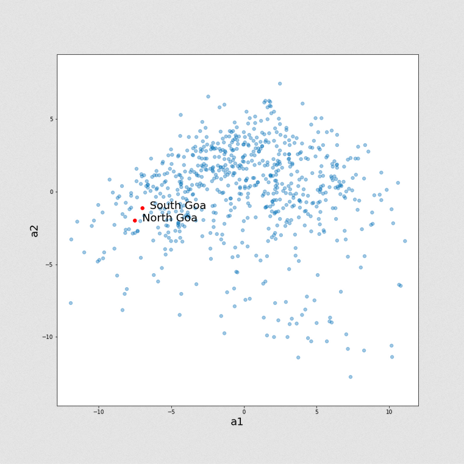
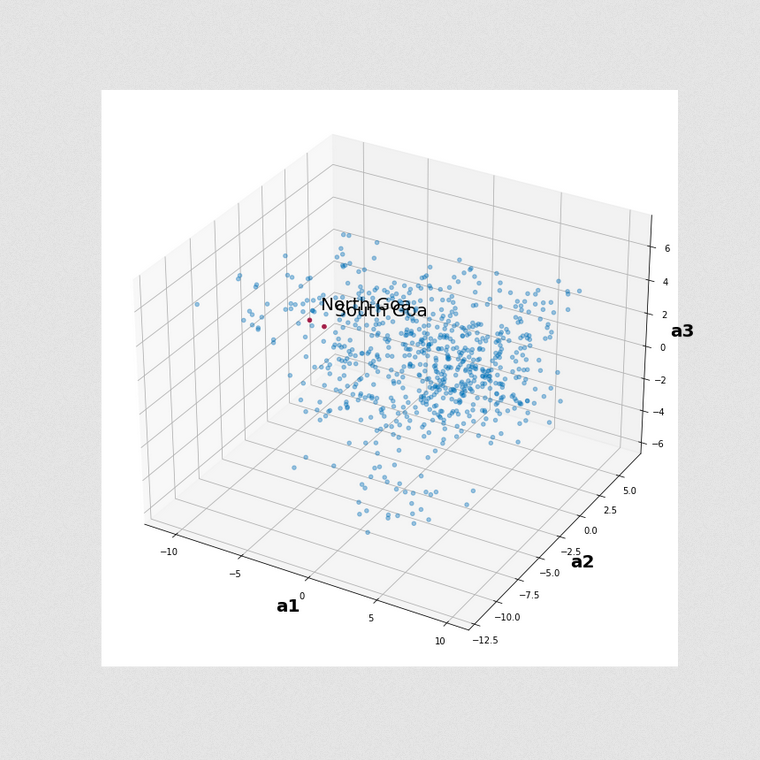
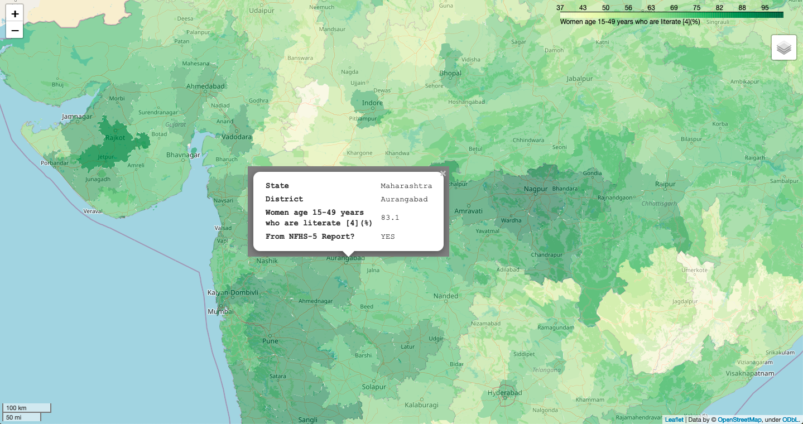
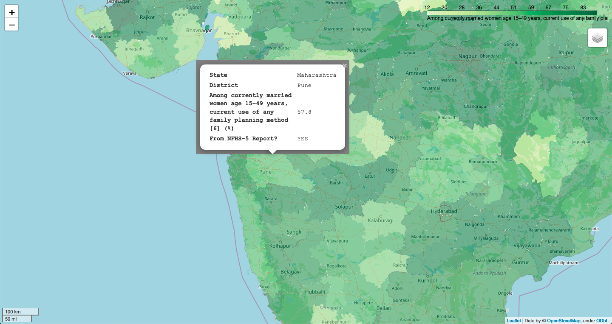
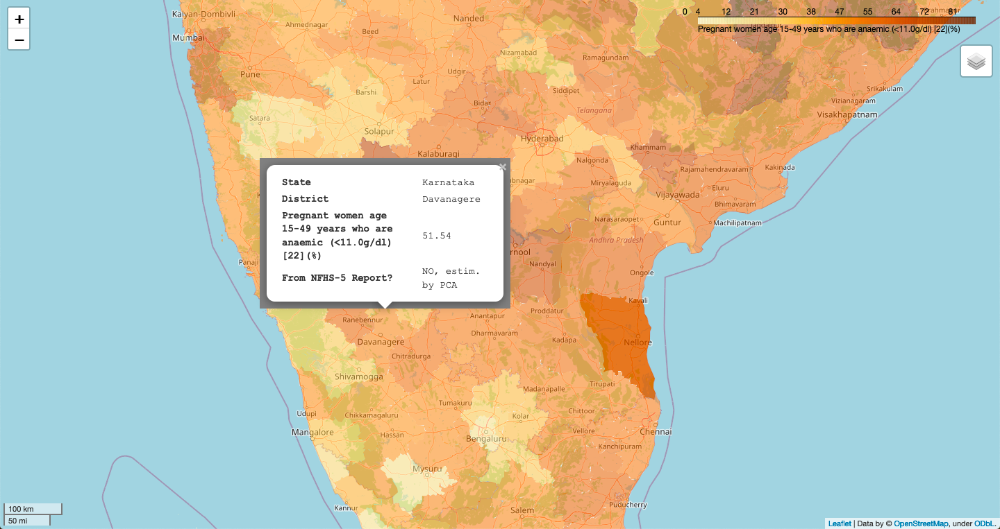

# Read, store and analyze NFHS-5 data from district-level summaries

1. __Download State and District-level PDFs__ [[Notebook](https://nbviewer.org/github/kalyaninagaraj/NFHS5/blob/main/NOTEBOOKS/1_DownloadPDFs.ipynb)]  
   Download PDF reports of key indicators for each state/UT and each of their districts from [http://rchiips.org/nfhs/](http://rchiips.org/nfhs/).
   
2. __Pickle the Indicators__ [[Notebook](https://nbviewer.org/github/kalyaninagaraj/NFHS5/blob/main/NOTEBOOKS/2A_PickleIndicators.ipynb), [Notebook](https://nbviewer.org/github/kalyaninagaraj/NFHS5/blob/main/NOTEBOOKS/2B_Questions.ipynb)]
   Save indicators, names of states/UTs and their respective districts in dictionary format for easy "pickling" (serializing).  
   
3. __Save district-level statistics to DataFrame__ [[Notebook](https://nbviewer.org/github/kalyaninagaraj/NFHS5/blob/main/NOTEBOOKS/3_WriteToDataFrame.ipynb), [PY](CODE/NFHS5.py)]  
   Read the PDF reports sequentially and store 104 indicator values for each of 700+ districts in a CSV file.
   
4. __Perform PCA, K-Means Clustering on the reported NFHS-5 data__ [[Notebook](https://nbviewer.org/github/kalyaninagaraj/NFHS5/blob/main/NOTEBOOKS/4_PCA.ipynb), [PY](CODE/PCA.py)]  
   Perform PCA to (1) plots 2D/3D representations of all 700+ data points, (2) find k-nearest neighbors to (3) impute missing (unavailable) values in the dataset. 
   
   For example, the plot below on the left is a 2D representation of the original 95-dimensional data. Each dot represents a district in the dataset, and  the two highlighted in red are from the state of Goa. This reduction in the data's orignal dimensionality (to 2 dimensions) explains only about 34% of the variance in the data. A 3D representation (on the right below) explains roughly 40% of the variance in the data.
   
|   2D representation by PCA  |  3D representation by PCA     |
|:-------------------------:|:-------------------------: |
|  |   |
      
   
5. __Display NFHS-5 data on interactive maps using GeoPandas__ [[Notebook](https://nbviewer.org/github/kalyaninagaraj/NFHS5/blob/main/NOTEBOOKS/5_Merge%20GeoPandas%20Shapefile%20and%20NFHS-5%20DataFrames.ipynb), [PY](CODE/plotMap.py)]  
   Generate maps to view reported statistics for each district. Missing or unavailable entries are estimated using Principal Component Analysis (PCA). The images below are screenshots of maps showing three such indicators (or statistics) for different districts in the country. The number of principal components for imputing missing entries is chosen in such a way so as to explain 99% percent of the variance in the dataset. 
   
   (a) __Percentage of literate women (aged 15-49)__   
   
      
   
   (b) __Percentage of married women (aged 15-49) who follow some family planning method__  
   
     
   
   (c) __Percentage of pregnant women (aged 15-49) who are anaemic__ 
   
     
   
  
## Code Credit
[@kalyaninagaraj](https://github.com/kalyaninagaraj/)

## Resources
1. [National Family Health Survey of India](http://rchiips.org/nfhs/factsheet_NFHS-5.shtml) (official website)
2. [fitz, or PyMuPDF](https://pymupdf.readthedocs.io/en/latest/intro.html) (documentation)
3. [pickle](https://docs.python.org/3/library/pickle.html) (documentaion)
4. [GeoPandas](https://geopandas.org) (documenatation)
5. [District boundary data of India](https://www.kaggle.com/datasets/imdevskp/india-district-wise-shape-files) in the form of shapefiles sourced from [Kaggle](www.kaggle.com)
