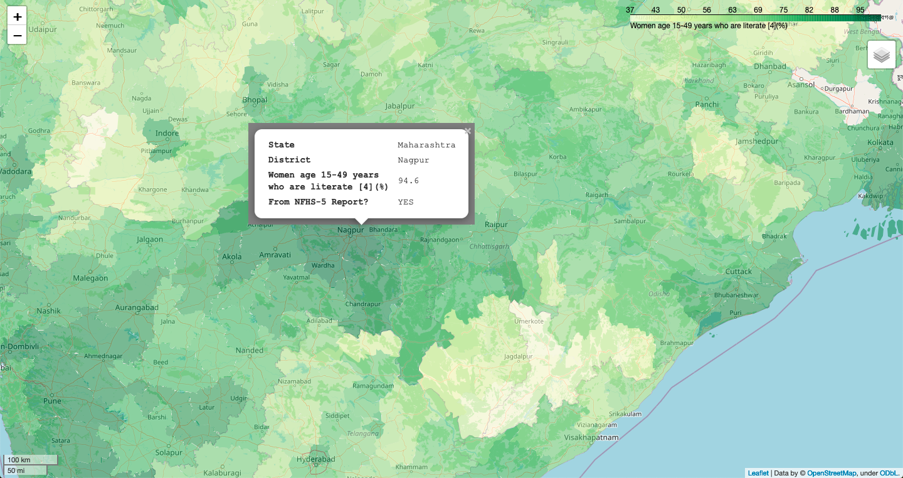

# Read, store and analyze NFHS-5 data from district-level summaries

1. [Download State and District-level PDFs](https://nbviewer.org/github/kalyaninagaraj/NFHS5/blob/main/DownloadPDFs.ipynb)  
   Download PDF reports of key indicators for each state/UT and each of their districts from [http://rchiips.org/nfhs/](http://rchiips.org/nfhs/)
   
2. [Pickle the Indicators](https://nbviewer.org/github/kalyaninagaraj/NFHS5/blob/main/PickleIndicators.ipynb)  
   Save indicators, names of states/UTs and their respective districts in dictionary format for easy "pickling" (serializing)  
   
3. [Save district-level statistics to DataFrame](https://nbviewer.org/github/kalyaninagaraj/NFHS5/blob/main/WriteToDataFrame.ipynb)  
   Read the PDF reports sequentially and store 104 indicator values for all 704 districts in a CSV file.
   
4. [Perform PCA on the reported NFHS-5 data]()  
   Perform PCA to (1) reduce dimensionality for plotting, and to (2) impute missing (unavailable) values in the dataset. 
   
5. [Display NFHS-5 data on maps using GeoPandas]()  
   Generate maps to view reported statistics for each district. Missing or unavailable entries are estimated using Principal Component Analysis (PCA). The images below are screenshots of three such statistics. 
   
   (1) __Percentage of literate women (aged 15-49)__ [Link to HTML map](https://github.com/kalyaninagaraj/NFHS5/blob/main/MAPS/Q14.html)  
   
      
   
   (2) __Percentage of married women (aged 15-49) who follow some family planning method__ [Link to HTML map](https://github.com/kalyaninagaraj/NFHS5/blob/main/MAPS/Q20.html)  
   
     
   
   (3) __Percentage of pregnant women (aged 15-49) who are anaemic__ [Link to HTML map](https://github.com/kalyaninagaraj/NFHS5/blob/main/MAPS/Q83.html)  
  
     
   
  
## Code Credit
[@kalyaninagaraj](https://github.com/kalyaninagaraj/)

## Resources
1. [National Family Health Survey of India](http://rchiips.org/nfhs/factsheet_NFHS-5.shtml) (official website)
2. [fitz, or PyMuPDF](https://pymupdf.readthedocs.io/en/latest/intro.html) (documentation)
3. [pickle](https://docs.python.org/3/library/pickle.html) (documentaion)
4. [GeoPandas](https://geopandas.org) (documenatation)
